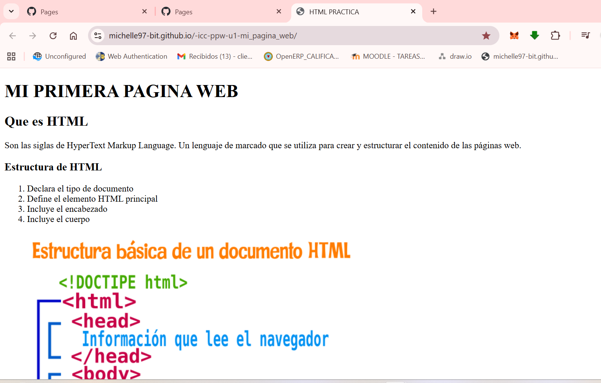

# Programación y Plataformas Web (PPW)

---

#  Práctica 1 – Explorando los Estándares Web con HTML, CSS y JavaScript

**Asignatura:** Programación y Plataformas Web  
**Unidad:** 1.2 – Estándares Web  
**Estudiante:** Michelle Morocho
**Repositorio:** https://github.com/Michelle97-bit/-icc-ppw-u1-mi_pagina_web
**Página desplegada (GitHub Pages):** [ https://michelle97-bit.github.io/-icc-ppw-u1-mi_pagina_web/]

---

## 🧱 Estructura HTML utilizada

| Componente | Descripción | Implementación |
|-------------|--------------|----------------|
| `<!DOCTYPE html>` | Declaración del documento HTML5 | Línea 1 |
| `<html lang="es">` | Idioma del documento | Español |
| `<header>` | Encabezado principal | Contiene `<h1>` y `<h2>` |
| `<section>` | Agrupa contenido principal | Dos secciones con `<h2>` |
| `<table>` | Muestra los elementos estudiados | Tres filas con `<th>` y `<td>` |
| `<footer>` | Pie de página | Nombre del estudiante y asignatura |

---

## 🧩 Nuevas etiquetas exploradas

| Etiqueta | Descripción | Implementación |
|-----------|--------------|----------------|
| `<figure>` | Contenedor para imagen | Estructura basica de HTML con `<figcaption>` |
| `<nav>` | agrupa enlaces de navegacion | navega por la misma pagina web |

**Código usado:**
<figure>
            
            <figcaption>Estrucura Basica de html</figcaption>
</figure>
<nav>
        <ul>
          <li><a href="/">Menu</a></li>
          <li><a href="/MI PRIMERA PAGINA WEB">Productos</a></li>
          <li><a href="/Autora">Nombre</a></li>
        </ul>
</nav>

```

#  Práctica 2 – Adición de CSS y JavaScript
---

### 1. Archivos agregados

| Archivo     | Descripción                                                                                         | Ubicación                 |
| ----------- | --------------------------------------------------------------------------------------------------- | ------------------------- |
| `style.css` | Contiene todos los estilos visuales del sitio (colores, tipografía, márgenes, botones, tabla, etc.) | Carpeta raíz del proyecto |
| `script.js` | Contiene las funciones y eventos JavaScript que agregan comportamiento dinámico                     | Carpeta raíz del proyecto |

Estructura final del proyecto:

```
icc-ppw-u1-mi_pagina_web/
│
├── index.html
├── README.md
├── script.js
└── style.css


### 2. Implementación en HTML

Los nuevos archivos se enlazaron dentro del documento `index.html` de la siguiente forma:

**En el `<head>` (para el CSS):**

```<link rel="stylesheet" href="style.css">
```

**Antes de cerrar el `<body>` (para el JavaScript):**

```<script src="script.js "></script>
```


---

### 3. Estilos aplicados con CSS

* COMLETAR LA TABLA

| Elemento                    | Estilo implementado                                            | Descripción                             |
| --------------------------- | -------------------------------------------------------------- | --------------------------------------- |
| `body`                      |  background-image   |         |                                    aplica imagen de fondo
| `header`                    | |  text-transform                                                  controla el uso de mayús y min del texto
| `table`                     |                              |                  |
| `button`                    |                                   |   |
| `section`                   |                                        |          |
| `progress`                  | `accent-color: #007bff; width: 100%;`                          | Personalización de la barra de progreso |


**Ejemplo en el código:**

```css

body {background-color:antiquewhite; 
    font-family: Verdana, Geneva, Tahoma, sans-serif; 
    margin: 5% ;
    background-image: url("https://img.freepik.com/vector-gratis/vector-onda-azul-transparente_1055-7084.jpg?semt=ais_hybrid&w=740&q=80");
}


header {background-color:rgba(134, 161, 185, 0.142); 
    color:black; 
    text-align: justify; 
    padding: 5%;
    text-transform: uppercase;
}


```

---

###  4. Interactividad agregada con JavaScript

El archivo `script.js` incorpora dos acciones básicas:

1. **Agregar una nueva fila a la tabla al presionar el botón**

   ```javascript
   document.getElementById("agregarFila").addEventListener("click", () => {
     const tabla = document.querySelector("table");
     const nuevaFila = tabla.insertRow();
     nuevaFila.innerHTML = "<td>&lt;article&gt;</td><td>Sección independiente del contenido</td>";
   });
   ```

2. **Cambiar el color del título al pasar el mouse por encima**

   ```javascript
   const titulo = document.getElementById("titulo");
   titulo.addEventListener("mouseover", () => {
     titulo.style.color = "orange";
   });
   titulo.addEventListener("mouseout", () => {
     titulo.style.color = "white";
   });
   ```


## Capturas de pantalla del proyecto final

* Agregar su captura de pantalla del proyecto final funcionando en el navegador, de ambas versiones (sin y con CSS/JS)


